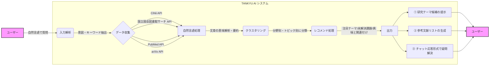

```mermaid
graph LR
    A[ユーザー] -->|自然言語で質問| B(入力解析);
    B -->|意図・キーワード抽出| C{データ収集};
    C -->|CiNii API| D[自然言語処理];
    C -->|国立国会図書館サーチ API| D;
    C -->|PubMed API| D;
    C -->|arXiv API| D;
    D -->|文章の意味解析・要約| E(クラスタリング);
    E -->|分野別・トピック別に分類| F(レコメンド処理);
    F -->|注目テーマ/未解決課題/興味と関連付け| G[出力];
    G --> H[① 研究テーマ候補の提示];
    G --> I[② 参考文献リストの生成];
    G --> J[③ チャット応答形式で疑問解決];
    H --> K[ユーザー];
    I --> K;
    J --> K;

    subgraph "TANKYU AI システム"
        B; C; D; E; F; G; H; I; J;
    end

    style A fill:#f9f,stroke:#333,stroke-width:2px
    style K fill:#f9f,stroke:#333,stroke-width:2px
```
