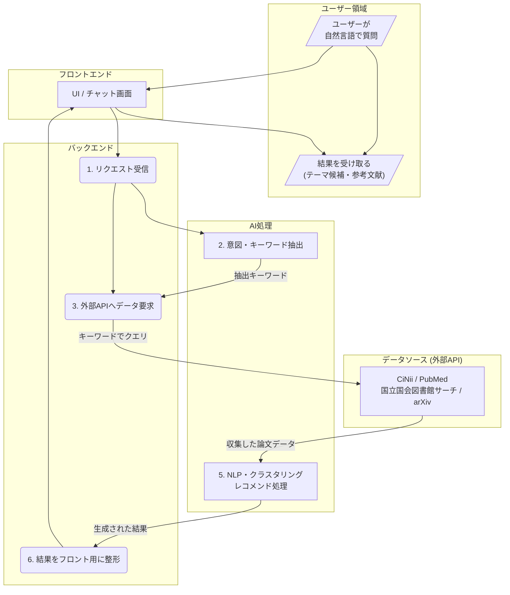

```mermaid
graph TD
    subgraph "ユーザー領域"
        direction LR
        U_IN[/"ユーザーが<br/>自然言語で質問"/] --> U_OUT[/"結果を受け取る<br/>(テーマ候補・参考文献)"/]
    end

    subgraph "フロントエンド"
        FE["UI / チャット画面"]
    end

    subgraph "バックエンド"
        direction TB
        BE_RCV("1. リクエスト受信") --> BE_API("3. 外部APIへデータ要求")
        BE_FMT("6. 結果をフロント用に整形")
    end

    subgraph "AI処理"
        direction TB
        AI_KWD["2. 意図・キーワード抽出"]
        AI_MAIN["5. NLP・クラスタリング<br>レコメンド処理"]
    end

    subgraph "データソース (外部API)"
        DS["CiNii / PubMed<br/>国立国会図書館サーチ / arXiv"]
    end

    %% コンポーネント間の処理フロー
    U_IN --> FE
    FE --> BE_RCV
    BE_RCV --> AI_KWD
    AI_KWD -- "抽出キーワード" --> BE_API
    BE_API -- "キーワードでクエリ" --> DS
    DS -- "収集した論文データ" --> AI_MAIN
    AI_MAIN -- "生成された結果" --> BE_FMT
    BE_FMT --> FE
    FE --> U_OUT
```
