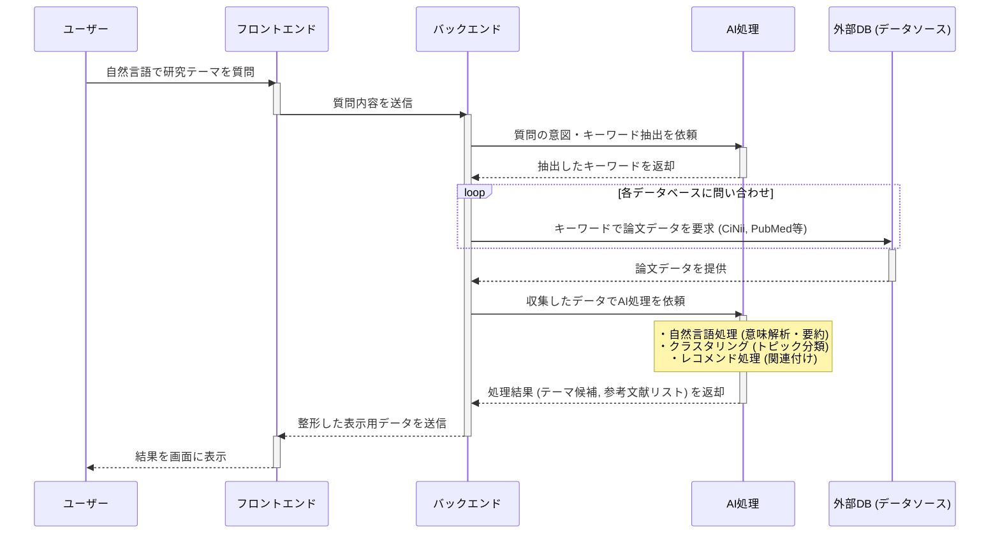

```mermaid
sequenceDiagram
    participant User as ユーザー
    participant Frontend as フロントエンド
    participant Backend as バックエンド
    participant AI as AI処理
    participant DB as 外部DB (データソース)

    User->>Frontend: 自然言語で研究テーマを質問
    activate Frontend
    Frontend->>Backend: 質問内容を送信
    deactivate Frontend
    activate Backend

    Backend->>AI: 質問の意図・キーワード抽出を依頼
    activate AI
    AI-->>Backend: 抽出したキーワードを返却
    deactivate AI

    loop 各データベースに問い合わせ
        Backend->>DB: キーワードで論文データを要求 (CiNii, PubMed等) 
    end

    activate DB
    DB-->>Backend: 論文データを提供
    deactivate DB

    Backend->>AI: 収集したデータでAI処理を依頼
    activate AI
    Note over AI: ・自然言語処理 (意味解析・要約) <br/>・クラスタリング (トピック分類) <br/>・レコメンド処理 (関連付け) 
    AI-->>Backend: 処理結果 (テーマ候補, 参考文献リスト) を返却
    deactivate AI

    Backend-->>Frontend: 整形した表示用データを送信
    deactivate Backend
    activate Frontend
    Frontend-->>User: 結果を画面に表示
    deactivate Frontend

```
